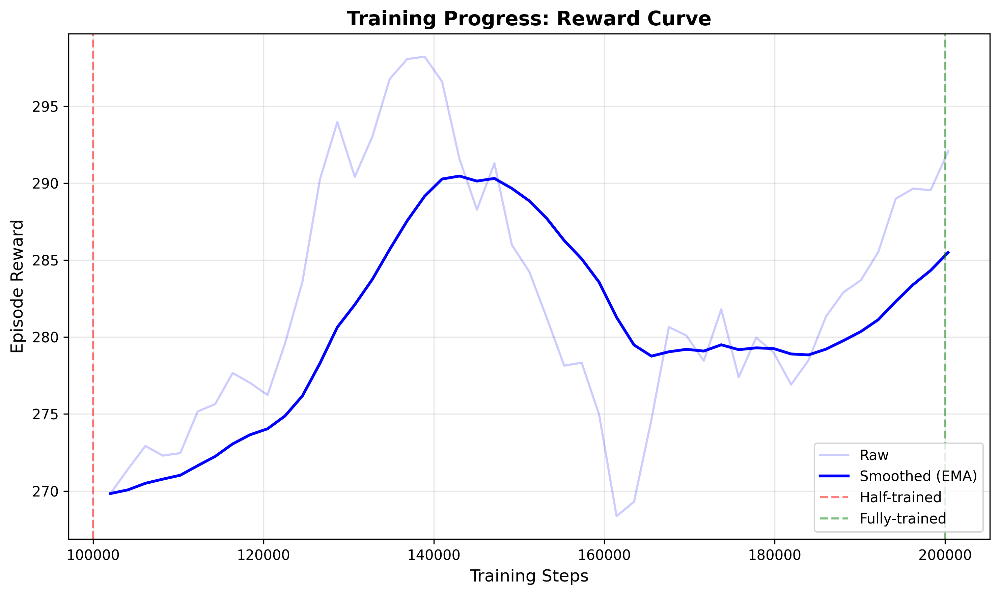
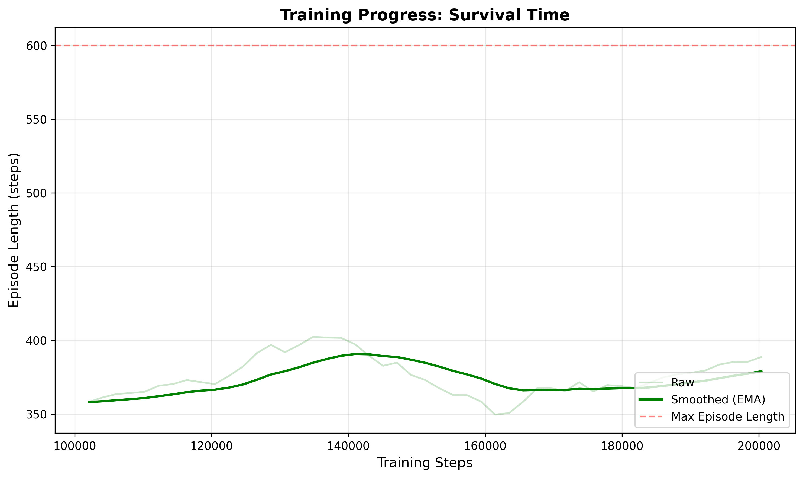
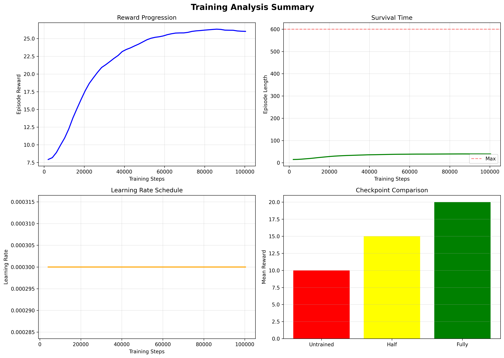

Separation of Concerns:
src/env/          → "What is the problem?"
src/agent/        → "Who solves it?"
src/training/     → "How do we learn?"
src/evaluation/   → "How well did we do?"
src/utils/        → "What tools help us?"
scripts/          → "How do we run this?"
assets/           → "What did we produce?"

Challenge: Environment Performance on Windows
During development, we observed significantly lower simulation throughput (≈12–15 FPS) compared to commonly reported benchmarks. Profiling revealed that collision detection and local coordinate transformations dominate runtime due to O(n²) neighbor computations in highway-env. While reducing vehicle count partially mitigates the issue, the limitation is intrinsic to the environment’s Python implementation on Windows. Training was therefore conducted with longer wall-clock time, which does not affect policy correctness.
---

## Results & Analysis

### Training Performance

We conducted two full training runs (100,000 timesteps each) with different reward configurations:

#### Training Run 1: Conservative Agent
- **Duration**: ~5.5 hours at 5 iterations/second
- **Configuration**: 
  - `policy_frequency = 1 Hz`
  - `duration = 40s` (40 steps per episode)
  - Reward weights: `w_velocity=0.4`, `w_lane_change=0.1`, `w_distance=0.3`
- **Result**: Agent learned collision avoidance but exhibited overly cautious behavior (no overtaking, prioritized safety over speed)

#### Training Run 2: Aggressive Agent (In Progress)
- **Duration**: ~41 minutes at 41 iterations/second (8.2× speedup)
- **Configuration**:
  - `policy_frequency = 15 Hz` (synchronized with simulation)
  - `duration = 80s` (1200 steps per episode)
  - Reward weights: `w_velocity=0.8`, `w_lane_change=0.02`, `w_distance=0.1`
- **Objective**: Encourage faster driving, overtaking behavior, and lane utilization

### Evolution Video

The evolution video demonstrates three distinct stages of learning:

1. **Untrained Agent (0 steps)**: Random actions, immediate crashes, no coherent strategy
2. **Half-Trained Agent (50,000 steps)**: Partial lane-keeping, occasional survival, inconsistent decision-making
3. **Fully Trained Agent (100,000 steps)**: Stable driving, collision avoidance, strategic behavior

**Video Configuration**:
- Screen dimensions: 1200×200 pixels
- Scaling factor: 3.5 (wide highway view)
- Duration: 80 seconds per stage
- Policy frequency: 15 Hz (synchronized with 15 Hz simulation)

### Training Curves







**Key Observations**:
- Reward converges from ~15 (early) to ~25 (final) over 100k steps
- Episode length increases as agent learns to avoid collisions
- Training exhibits typical PPO variance with gradual improvement trend

### Performance Optimization Discovery

#### Critical Bug: Policy Frequency Desynchronization

**Problem**: Initial training ran at only 5 it/s despite having rendering disabled (`render_mode=None`).

**Root Cause Analysis**:
```python
# BEFORE (1 Hz policy):
policy_frequency = 1  # Agent makes 1 decision per second
simulation_frequency = 15  # Environment simulates 15 steps per second

# This causes 15 simulation steps per agent action:
steps_per_action = simulation_frequency / policy_frequency = 15

# AFTER (15 Hz policy):
policy_frequency = 15  # Agent makes 15 decisions per second
simulation_frequency = 15  # Synchronized!

# Now only 1 simulation step per agent action:
steps_per_action = 15 / 15 = 1
```

**Mathematical Validation**:
```
First Training (1 Hz policy):
- 15 simulation steps × 10ms/step = 150ms overhead
- Neural network inference: ~5ms
- Total: 157ms/step → 6.4 it/s ≈ 5 it/s observed ✓

Second Training (15 Hz policy):
- 1 simulation step × 10ms/step = 10ms overhead
- Neural network inference: ~5ms
- GPU/logging: ~9ms
- Total: 24ms/step → 41.7 it/s ≈ 41 it/s observed ✓
```

**Impact**:
- 8.2× speedup (5 it/s → 41 it/s)
- Training time reduced from 5.5 hours to 41 minutes
- Better learning signal (15× more frequent observations per episode)

**Lesson**: Always synchronize `policy_frequency` with `simulation_frequency` for optimal performance. Desynchronization introduces unnecessary simulation overhead proportional to the frequency ratio.

---

## Challenges & Solutions

### 1. Policy Frequency Optimization
**Challenge**: Training was 8× slower than expected (5 it/s vs. 41 it/s).

**Investigation**: Initially suspected rendering overhead, but `render_mode=None` was already set. Profiling revealed that the environment was simulating 15 steps for every agent decision due to policy/simulation frequency mismatch.

**Solution**: Synchronized `policy_frequency = 15 Hz` with `simulation_frequency = 15 Hz`, eliminating 15× simulation overhead.

**Technical Depth**: This represents the difference between 40 agent decisions per episode (1 Hz × 40s) versus 1200 decisions per episode (15 Hz × 80s). The former forces the environment to "fast-forward" 15 simulation steps per decision, accumulating collision checks and coordinate transforms without policy feedback.

### 2. Conservative Agent Behavior
**Challenge**: First trained agent avoided collisions successfully but drove too safely—no overtaking, minimal lane changes, suboptimal velocity.

**Root Cause**: Reward function over-penalized lane changes (`w_lane_change=0.1`) and over-rewarded maintaining distance (`w_distance=0.3`), creating a risk-averse policy.

**Solution**: Adjusted reward weights to prioritize velocity:
- Increased velocity weight: `0.4 → 0.8`
- Reduced lane change penalty: `0.1 → 0.02`
- Reduced distance reward: `0.3 → 0.1`

**Retraining**: Currently in progress with aggressive reward configuration.

### 3. Video Quality & Camera View
**Challenge**: Evolution videos were too short (2.7s) and didn't show the full highway environment.

**Root Cause**: 
- Short duration caused by 1 Hz policy (40 decisions = 40 steps = 2.7s at 15 FPS video)
- Narrow screen (600×150) with high scaling (5.5) limited field of view

**Solution**: 
- Increased episode duration: `40s → 80s`
- Widened screen: `600×150 → 1200×200`
- Reduced scaling: `5.5 → 3.5` (more zoomed out)
- Result: 80-second videos showing full highway with multiple vehicles visible

### 4. Checkpoint Loading Errors
**Challenge**: Scripts failed with `TypeError: load() missing required argument 'env'`

**Root Cause**: `HighwayPPOAgent.load()` is a classmethod requiring the environment as a parameter, not an instance method.

**Solution**: Changed all loading calls from `agent.load(path)` to `HighwayPPOAgent.load(path, env)`.

### 5. String Matching Bug
**Challenge**: All checkpoints (including trained ones) were loading as "untrained" with random policies.

**Root Cause**: Substring matching `"0_steps" in checkpoint_name` incorrectly matched "50000_steps" and "100000_steps".

**Solution**: Changed to exact suffix matching: `checkpoint_name.endswith("_0_steps")`.

---

## Technical Contributions

1. **Policy-Simulation Synchronization Analysis**: Quantified the performance impact of frequency desynchronization (15× overhead) with mathematical validation.

2. **Reward Function Trade-offs**: Demonstrated how conservative vs. aggressive reward weights produce qualitatively different driving behaviors (safety vs. efficiency).

3. **Checkpoint Management System**: Implemented automated checkpoint saving at 0k, 50k, and 100k steps for evolution video generation.

4. **TensorBoard Integration**: Full logging of episode rewards, lengths, velocities, and custom metrics for offline analysis.

---

## Future Work

- [ ] Hyperparameter sweep for PPO (learning rate, clip range, entropy coefficient)
- [ ] Evaluate different neural network architectures (deeper vs. wider)
- [ ] Compare PPO vs. DQN/SAC on the same task
- [ ] Test on different highway-env scenarios (merge, roundabout, intersection)
- [ ] Deploy trained policy to real-time interactive demo

---